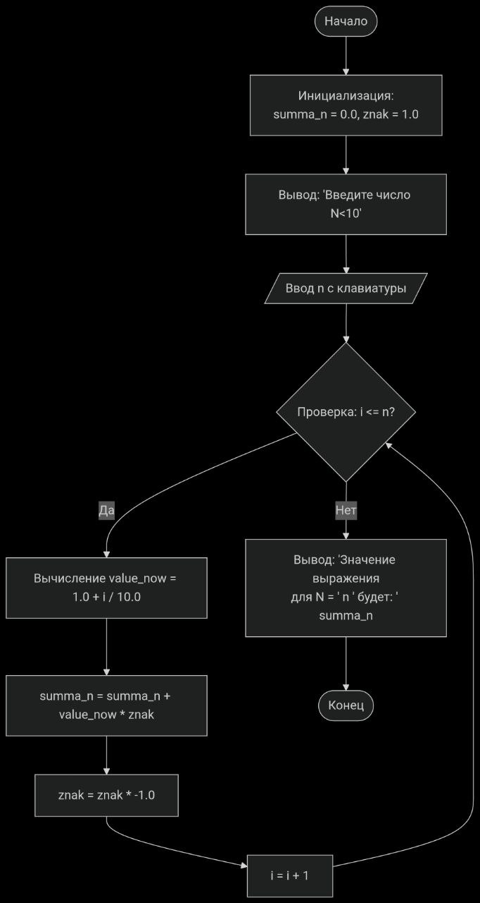

# Вариант 5
Вычислите для целого N (N<10), заданного пользователем, значение
знакопеременного выражения
1.1 – 1.2 + 1.3 –...
Условный оператор не использовать

### Блок-схема
 

### Результат выполнения
При вводе т = 5 результат будет 1.3
